# 目录

[TOC]

# 1 安装
## 1.1 解压插件文件夹

到 https://github.com/cilame/v_jstools 地址下载文件然后解压。

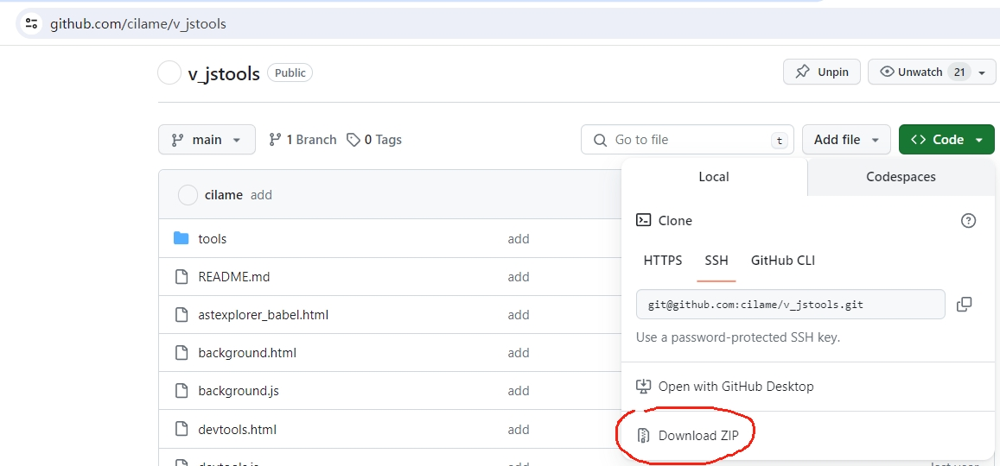

## 1.2 点开chrome插件管理页面
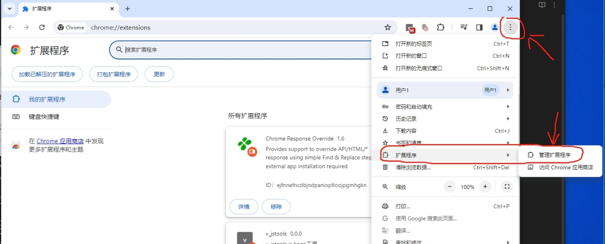

## 1.3 打开开发者模式
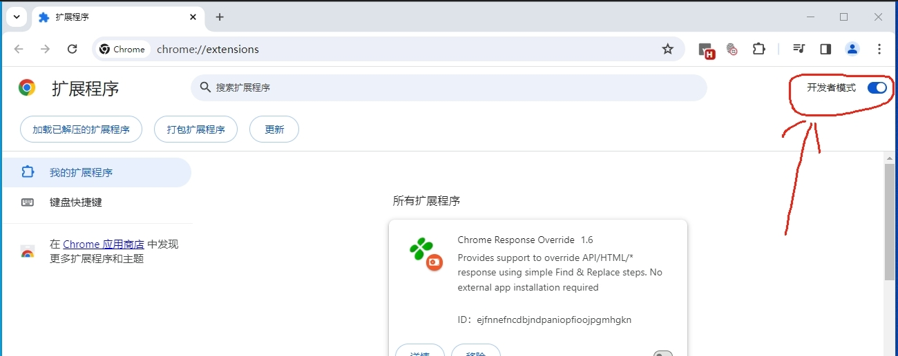

## 1.4 将解压的插件文件夹拖放到插件管理页面
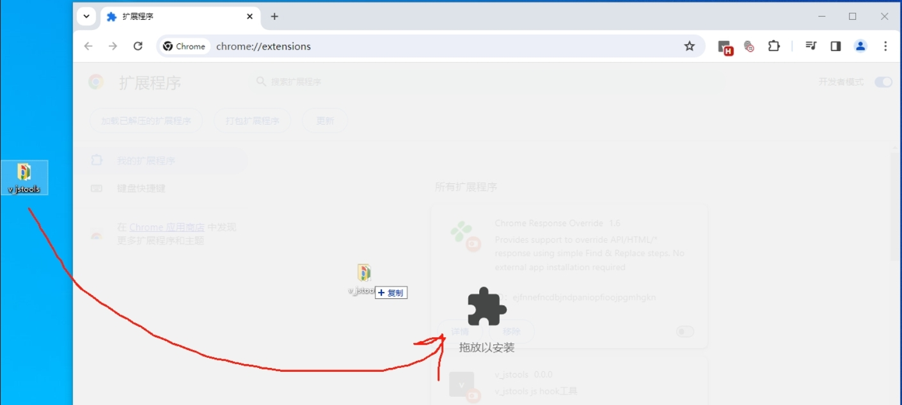

## 1.5 将插件固定方便使用
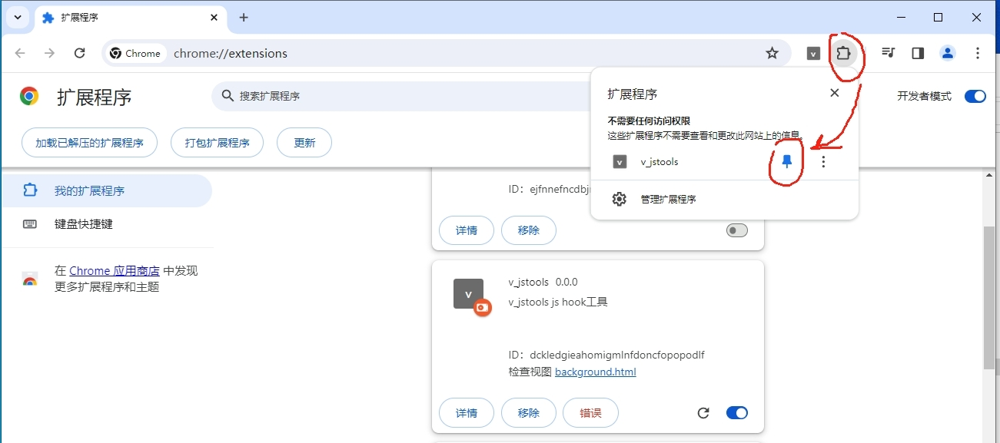

# 2 自动补环境

## 2.1 点击生成

进入需要调试的页面后，点击插件图标，然后点击生成临时环境即可。将生成的代码拷贝出去贴在目标的代码的前面，一个简单的补还经就已经能自动做好了。
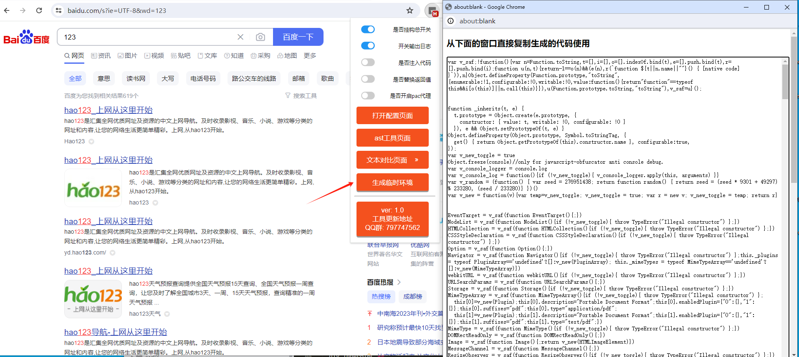

## 2.2 *注意

如果出现以下弹窗，那么点击确认后，页面会刷新，然后回自动将补环境需要的配置自动选中，然后你再次重复点击生成临时环境的按钮就能生成环境代码了。
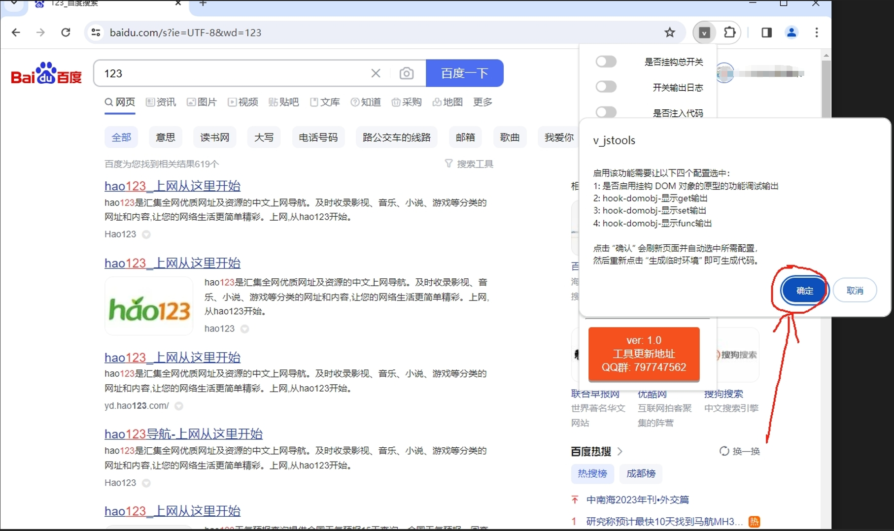

# 3 hook大部分网页的函数接口

## 3.1 配置页面
配置是按照大小分类来确定hook的接口，这样你可以按照你需要的配置需要快速关闭某些分类的接口，例如你关掉上图中的2的开关，那么整个 "函数接口hook" 就无法使用了，但是其他需要注入的功能不影响。

## 3.2 启用效果
这样的日志对于分析代码的各个接口调用情况是比较方便的。
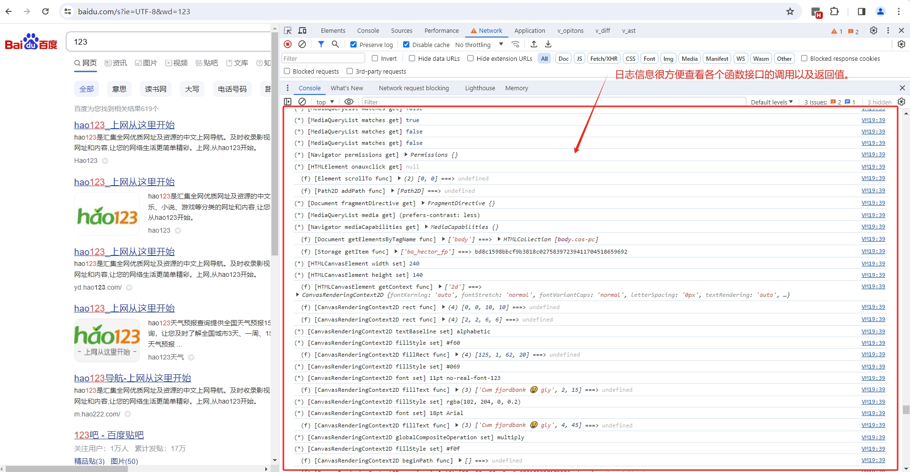

## 3.3 接口cookie
cookie 这块其实稍微特殊一点，且常用一点，所以我这里特别加了一个方便的断点处理，对 cookie 中匹配了字符串的 cookie 直接下 debugger 断点，这样方便从堆栈中找到设置 cookie 的地方，方便找到 cookie 加密的点。
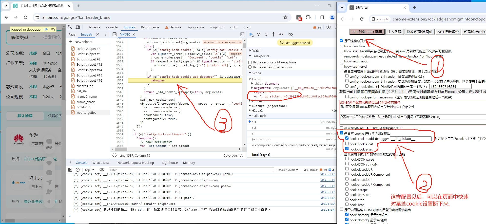

## 3.4 常用编解码函数
对这累常见的编码函数挂钩，对于一些常见的算法库来说有奇效，因为常见的算法库需要通过这些函数做编码转换，所以一旦hook到很可能就能拿到这些参数的一些密钥。
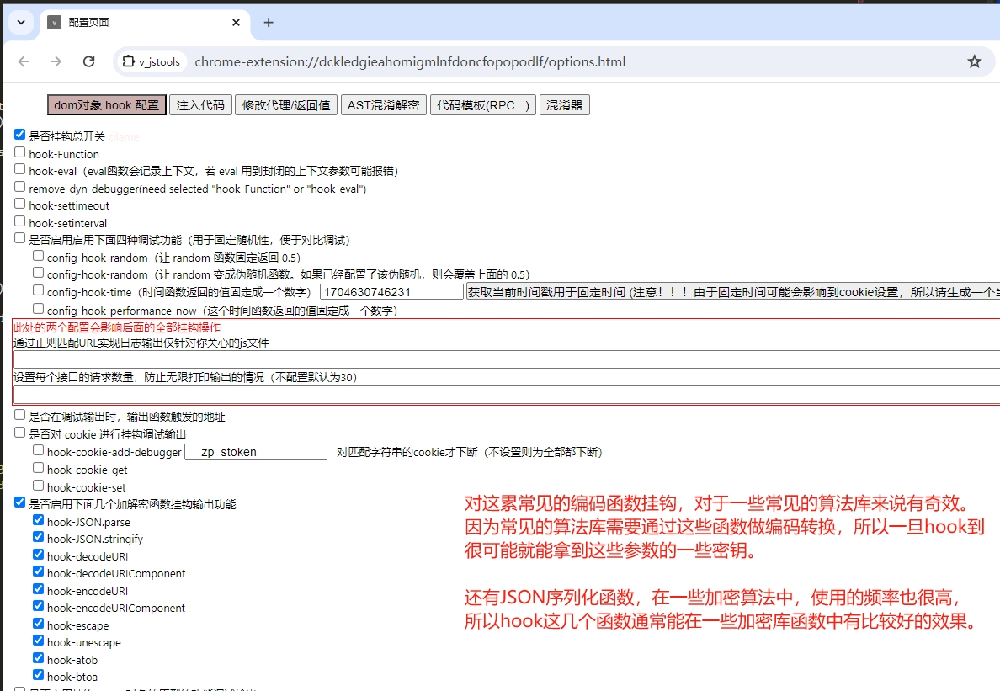
还有JSON序列化函数，在一些加密算法中，使用的频率也很高，所以hook这几个函数通常能在一些加密库函数中有比较好的效果。
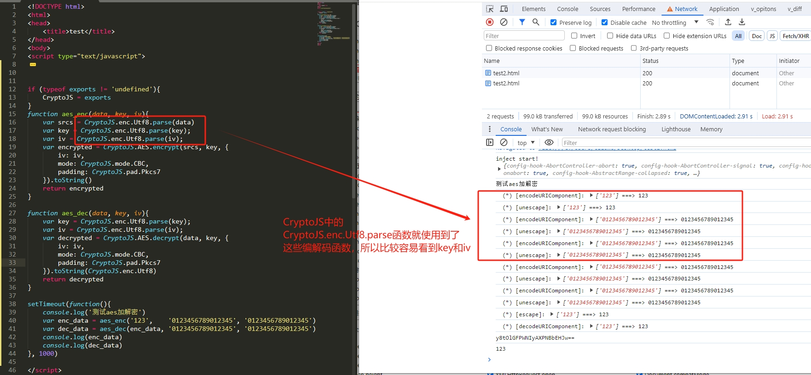

# 4 代码注入

这里的代码注入方式有两种
1注入时机较晚，但是无需打开调试模式（通常是head渲染后，body渲染前执行）
2注入时机最早，需要打开调试模式（可以稳定在head渲染之前执行）
这两种注入建议不要同时使用。

## 4.1 第一种注入
这种注入的代码执行的时机比较晚，因为需要可配置代码，chrome插件读取配置信息是异步的，读取的过程会让页面加载一部分，有时候甚至 body 都加载了才执行。使得执行时机不够早，通常来说和油猴插件功能差不多。但是对于一些 head 时期就加载的代码就不方便提前挂钩调试。
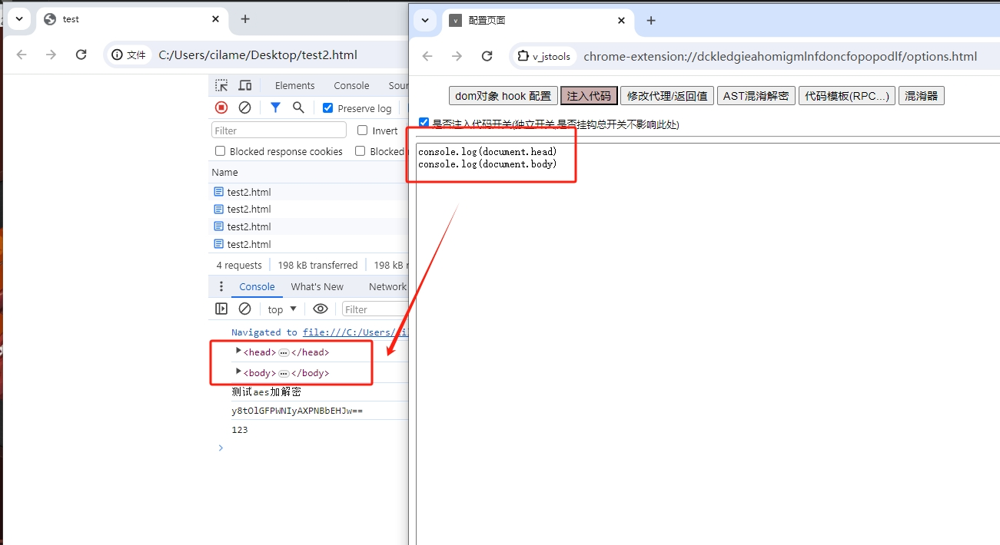

## 4.2 第二种注入
可以在所有页面加载前就注入，执行时机最早，但是涉及CDP协议方面，页面调试过程中比较容易崩溃，一般用来调试一些比较难捕捉的 head 里面就执行的函数。
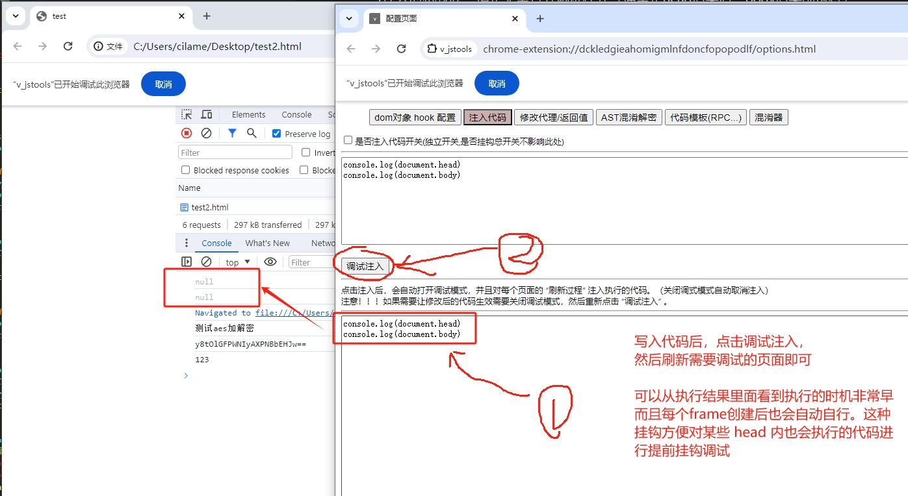

# 5 代理切换

这个功能就是 Proxy SwitchyOmega 功能的极简版平替。在没有安装 Proxy SwitchyOmega 插件的时候勉强可以用一用。
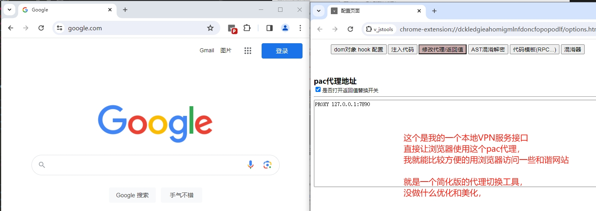

# 6 替换返回参数

这个功能就是 ReRes 功能的极简版平替。在没有安装 ReRes 插件的时候勉强可以用一用。
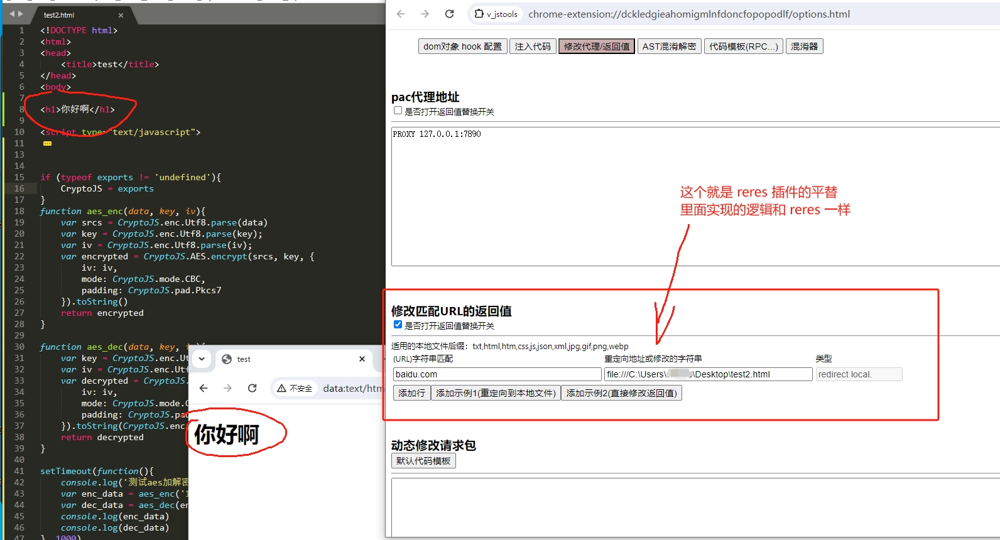

# 7 常用的AST解密工具

## 7.1 sojson
直接将sojson代码丢进去尝试解密一下，通常 v5 都能直接解密。
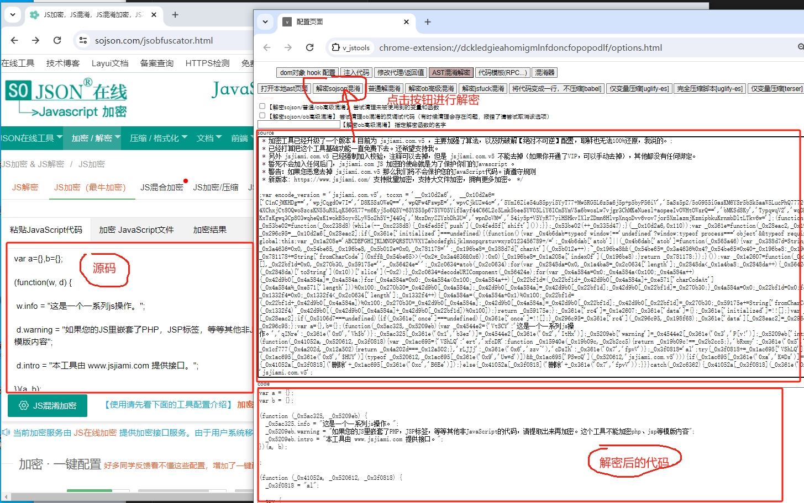

## 7.2 jsjiami
由于 sojson 和 jsjiami 的实现逻辑都是通过开源的 ob 混淆进行微创新搞的，所以ob解混淆通常都能解密。不过ob解混淆有时候需要稍微处理一下才能解开。
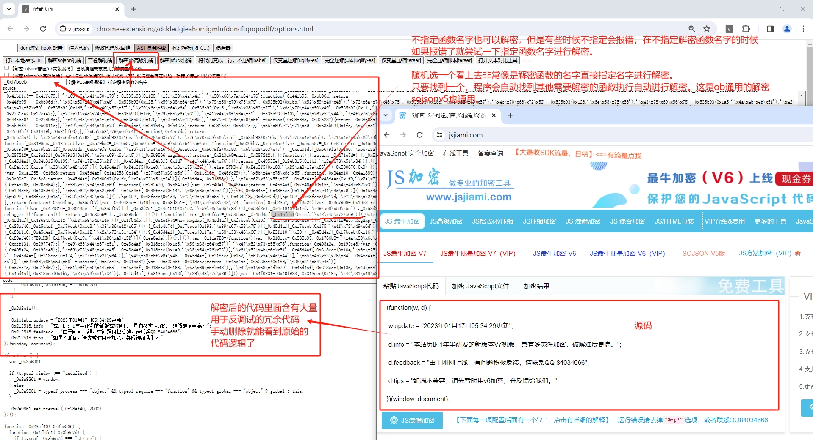

# 支持作者

这里是作者的星球 https://wx.zsxq.com/dweb2/index/group/15552845822482 愿意支持一下的可以支持一下。另外星球内提供了一个通用的 wx devtools 开启工具。无需任何依赖，就一个 exe 程序，开启后，在微信打开的情况下点击 inject 按钮就可以开启 devtools 了。

另外注意，请在点击 inject 后 15秒内点开工具，因为 15秒后，该功能会自动修复 hook 的接口，防止内存扫描。

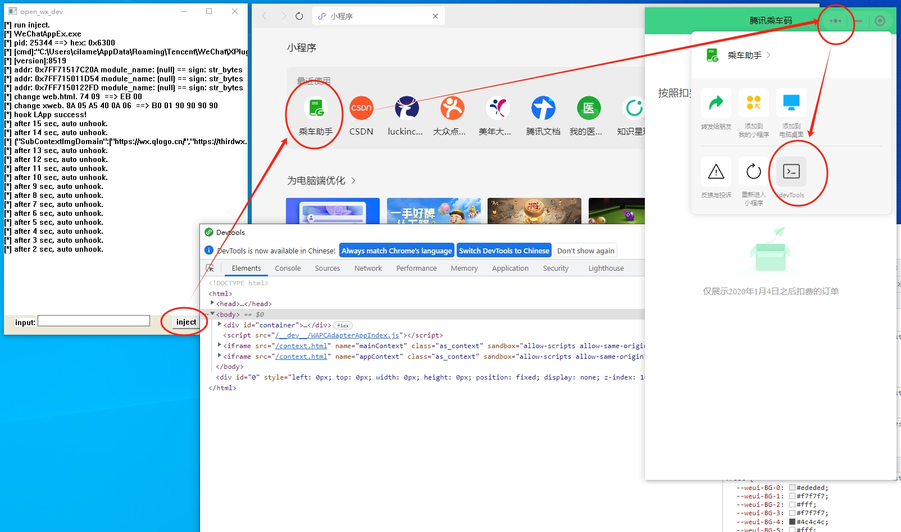

工具地址 https://t.zsxq.com/16dLGegqc 。64位 wx devtools 通用开启工具。

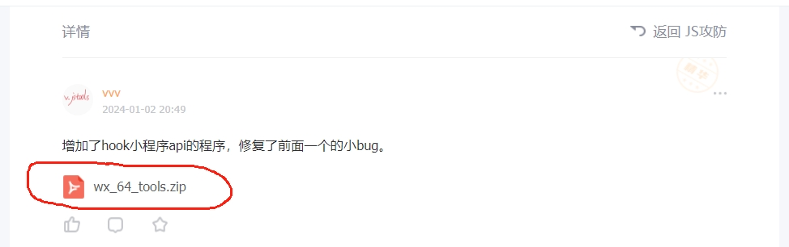

